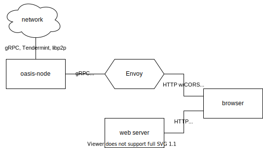
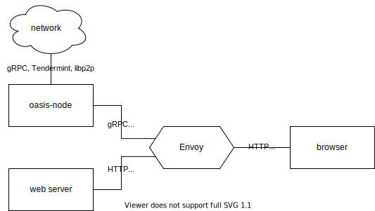

# Getting started

## Overview

1. Getting this SDK and building
1. Connecting from your web app

## Getting this SDK and building

```sh
npm install @oasisprotocol/client
```

You'll need a bundler.
We have [a sample that uses webpack](../playground/webpack.config.js).

## Connecting from your web app

```js
import * as oasis from '@oasisprotocol/client';

// Use https://testnet.grpc.oasis.io to interact with the testnet instead.
const nic = new oasis.client.NodeInternal('https://grpc.oasis.io');
```

This connects to a public oasis-node instance.
For security and performance reasons, some methods are not permitted.
See the Advanced deployment section below for how to set up your own node with
a custom set of enabled methods.

## Running in Node.js

This package and some of its dependencies do not support running in Node.js.
Only use this package in browsers.

# Example code

We have [a few sample interactions](../playground/src/index.js).

Not all methods used in this sample are permitted on the public oasis-node
instance.
See the Advanced deployment section below for how to set up your own node with
a custom set of enabled methods.

# Now what

## How to cross reference the Go codebase

**gRPC method wrappers**
`oasis.client.NodeInternal.prototype.<moduleName><MethodName>` methods are defined
in oasis-core as a Go `MethodDesc` structure (construction looks like
`method<MethodName> = serviceName.NewMethod( ...`) in a
`<modulename>/api/grpc.go` file.
Follow the `MethodDesc` references to a client method (callsite looks like
`c.conn.Invoke(ctx, method<MethodName> ...`) for interface documentation and
to a handler function (named like `handler<MethodName>`) to get implementation
details.

**Structure types** `<ModuleName><TypeName>` here all appear in a single
`types.ts` module.
In oasis-core, the Go types show up in separate modules and sometimes in
submodules whose names don't show up in the TypeScript names here.
Types named the same thing as the module are singly named here; for example,
`signature.Signature` from oasis-core is just `Signature` here, not
`SignatureSignature`.
Most non-structure types don't have dedicated types on the TypeScript side.
For example, `signature.PublicKey`, `hash.Hash`, and `address.Address` are all
plain `Uint8Array`s.

**Helpers** are mostly newly written in TypeScript and have slightly different
style from oasis-core.
Thus they often don't correspond to any specific Go function.
All you can do is look at the TypeScript source.

**Modules** are named after corresponding Go modules in oasis-core, but the
hierarcical breakdown is not fully mirrored.
For example, the `go/runtime/client` module from oasis-core is part of a
single `runtime.ts` module here.
Collections of helpers corresponding to functionality from `go/common/...`
modules appear in their own module here instead of in `common.ts` when they
mostly don't correspond to oasis-core functions.

**Constants** are named reminiscent to their oasis-core counterparts, but they
are in PascalCase in Go and SCREAMING_SNAKE_CASE here.
(We've also nabbed some top secret camelCase Go private constants, but don't
tell anyone.)
Some constants like signature contexts and errors are structures in oasis-core
but appear here as multiple primitive values.

# Advanced deployment

You can also run your own Oasis node with gRPC proxy.

<!-- Authored on https://app.diagrams.net/. -->


## Overview

1. Setting up a non-validator node
1. Getting Envoy
1. Configuring Envoy
1. Running Envoy
1. Using the SDK with your node

## Setting up a non-validator node

Setting up a node results in a running process with a Unix domain socket named
`internal.sock` that allows other programs to interact with the node, and
through that, the network.
We have external documentation both on setting up a node to connect to an
existing network such as the mainnet or testnet and on setting up an entire
local testnet of your own.

### Connect to an existing network

For use with an existing network such as the Oasis Mainnet, see [our docs on
how to run a non-validator
node](/general/run-a-node/set-up-your-node/run-non-validator).
The instructions there set up the socket to be in `/node/data/internal.sock`.

### Create a local testnet

For development, you can alternatively run your own local testnet using
oasis-net-runner.
See [our guide on how to use
oasis-net-runner](/oasis-core/development-setup/running-tests-and-development-networks/oasis-net-runner).
In this case, the net runner creates a "client" node, and you should proceed
using that node's socket.
The instructions there set up the socket to be in
`/tmp/oasis-net-runnerXXXXXXXXX/net-runner/network/client-0/internal.sock`,
where the `XXXXXXXXX` is a random number.

## Getting Envoy

See [Installing
Envoy](https://www.envoyproxy.io/docs/envoy/latest/start/install)
for a variety of ways to get Envoy.

In our tests, we use [the prebuilt binaries from Tetrate
Labs](https://github.com/tetratelabs/archive-envoy).

## Configuring Envoy

Notably, you need to configure a route to forward requests from the distinctly
browser-compatible gRPC-web protocol to the Unix domain socket in native gRPC.

See [our sample configuration](../playground/sample-envoy.yaml) for one way to
do it.
You'll need to adjust the following:

- `.match.safe_regex.regex` in the route, for setting up a method whitelist
- `.load_assignment.endpoints[0].lb_endpoints[0].endpoint.address.pipe.path`
  in the `oasis_node_grpc` cluster, to point to your node's socket
- `.cors.allow_origin_string_match` in the virtual host to match your client's
  origin(s)

You can alternatively remove the CORS configuration and add another cluster to
proxy the client through Envoy as well, so that it is same-origin with the
gRPC-web endpoints.



## Running Envoy

In our sample, we run Envoy and proxy the web app through it.

See [our sample invocation](../playground/sample-run-envoy.sh).

If you're running Envoy in Docker, you can use volume mounts to allow envoy
to access the YAML config file and the node's UNIX socket.

## Using the SDK with your node

When you create an `oasis.client.NodeInternal`, pass the HTTP endpoint of your
Envoy proxy:

```js
const client = new oasis.client.NodeInternal('http://127.0.0.1:42280');
```
