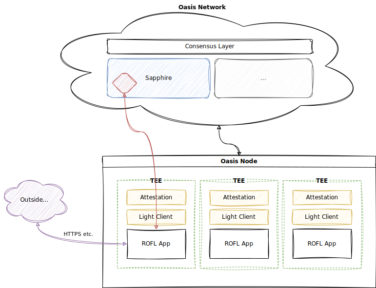

# Application

This chapter will show you how to quickly create, build and test a minimal
ROFL app that serves as a simple oracle, fetching data from remote sources via
HTTPS and posting it on chain for aggregation.

## How do ROFL Apps Work?



Each ROFL app runs in its own Trusted Execution Environment (TEE) which is
provisioned by an Oasis Node from its _bundle_ (a zip archive containing the
program binaries and metadata required for execution). ROFL apps register to
the Oasis Network in order to be able to easily authenticate to on-chain smart
contracts.

Inside the TEE, the ROFL app performs important functions that ensure its
security and enable secure communication with the outside world. This includes
using a light client to establish a fresh view of the Oasis consensus layer
which provides a source of rough time and integrity for verification of all
on-chain state. The ROFL app also generates a set of ephemeral cryptographic
keys which are used in the process of remote attestation and on-chain
registration. These processes ensure that the ROFL app can authenticate to
on-chain modules (e.g. smart contracts running in the [Sapphire runtime]) by
signing and submitting special transactions.

The ROFL app can then perform arbitrary work and interact with the outside world
through (properly authenticated) network connections. Connections can be
authenticated via HTTPS/TLS or use other methods (e.g. light clients for other
chains).

[Sapphire runtime]: https://github.com/oasisprotocol/docs/blob/main/docs/dapp/sapphire/README.mdx
[Sapphire Testnet]: https://github.com/oasisprotocol/docs/blob/main/docs/node/testnet/README.md#sapphire

## Repository Structure and Dependencies

:::info

You can find the entire project inside the Oasis SDK repository under
[`examples/runtime-sdk/rofl-oracle`].

<!-- markdownlint-disable line-length -->
[`examples/runtime-sdk/rofl-oracle`]: https://github.com/oasisprotocol/oasis-sdk/tree/main/examples/runtime-sdk/rofl-oracle
<!-- markdownlint-enable line-length -->

:::

First we create the basic directory structure for the minimal runtime using
Rust's [`cargo`]:

```shell
cargo init rofl-oracle
```

This will create the `rofl-oracle` directory and populate it with some
boilerplate needed to describe a Rust application. It will also set up the
directory for version control using Git. The rest of the guide assumes that you
are executing commands from within this directory.

Since the Runtime SDK requires a nightly version of the Rust toolchain, you need
to specify a version to use by creating a special file called
`rust-toolchain.toml` containing the following information:

<!-- markdownlint-disable line-length -->

<!-- markdownlint-enable line-length -->

Additionally, due to the requirements of some upstream dependencies, you need to
configure Cargo to always build with specific target CPU platform features
(namely AES-NI and SSE3) by creating a `.cargo/config.toml` file with the
following content:

```toml title=".cargo/config.toml"
[build]
rustflags = ["-C", "target-feature=+aes,+ssse3"]
rustdocflags = ["-C", "target-feature=+aes,+ssse3"]

[test]
rustflags = ["-C", "target-feature=+aes,+ssse3"]
rustdocflags = ["-C", "target-feature=+aes,+ssse3"]
```

After you complete this guide, the directory structure will look as follows:

```
rofl-oracle
├── .cargo
│   └── config.toml      # Cargo configuration.
├── Cargo.lock           # Rust dependency tree checksums.
├── Cargo.toml           # Rust crate defintion.
├── rust-toolchain.toml  # Rust toolchain version configuration.
└── src
    └── main.rs          # The ROFL app definition.
```

[`cargo`]: https://doc.rust-lang.org/cargo

## App Definition

First you need to declare the required dependencies on `oasis-runtime-sdk` and
related crates in order to be able to use the required features. To do this,
edit the `[dependencies]` section in your `Cargo.toml` to look like the
following:


After you have declared the required dependencies the next thing is to define
the ROFL app. To do this, create `src/main.rs` with the following content:

<!-- markdownlint-disable line-length -->

<!-- markdownlint-enable line-length -->

## Testing it on Sapphire Localnet

The simplest way to test and debug your ROFL is locally.

1. Disable trust root verification in [`src/main.rs`]. Replace:


   with an empty root:

   ```rust
    fn consensus_trust_root() -> Option<TrustRoot> {
        // DO NOT USE IN PRODUCTION!
        None
    }
   ```

2. Compile ROFL in the *unsafe* mode:

   ```shell
   oasis rofl build sgx --mode unsafe
   ```

3. Spin up the Sapphire Localnet docker container and mount your `rofl-oracle`
   folder to `/rofls` inside the docker image:

   ```shell
   docker run -it -p8545:8545 -p8546:8546 -v rofl-oracle:/rofls ghcr.io/oasisprotocol/sapphire-localnet
   ```

In a few moments, the Sapphire Localnet will spin up and automatically launch
your ROFL inside the compute node.

```
sapphire-localnet 2024-09-19-git2332dba (oasis-core: 24.2, sapphire-paratime: 0.8.2, oasis-web3-gateway: 5.1.0)

 * Detected ROFL bundle: /rofls/rofl-oracle.orc
 * Starting oasis-net-runner with sapphire...
 * Waiting for Postgres to start....
 * Waiting for Oasis node to start.....
 * Starting oasis-web3-gateway...
 * Bootstrapping network (this might take a minute)...
 * Waiting for key manager......
 * Populating accounts...

Available Accounts
==================
(0) 0xf39Fd6e51aad88F6F4ce6aB8827279cffFb92266 (10000 TEST)
(1) 0x70997970C51812dc3A010C7d01b50e0d17dc79C8 (10000 TEST)
(2) 0x3C44CdDdB6a900fa2b585dd299e03d12FA4293BC (10000 TEST)
(3) 0x90F79bf6EB2c4f870365E785982E1f101E93b906 (10000 TEST)
(4) 0x15d34AAf54267DB7D7c367839AAf71A00a2C6A65 (10000 TEST)

Private Keys
==================
(0) 0xac0974bec39a17e36ba4a6b4d238ff944bacb478cbed5efcae784d7bf4f2ff80
(1) 0x59c6995e998f97a5a0044966f0945389dc9e86dae88c7a8412f4603b6b78690d
(2) 0x5de4111afa1a4b94908f83103eb1f1706367c2e68ca870fc3fb9a804cdab365a
(3) 0x7c852118294e51e653712a81e05800f419141751be58f605c371e15141b007a6
(4) 0x47e179ec197488593b187f80a00eb0da91f1b9d0b13f8733639f19c30a34926a

HD Wallet
==================
Mnemonic:       test test test test test test test test test test test junk
Base HD Path:   m/44'/60'/0'/0/%d

 * Configuring ROFL /rofls/rofl-oracle.orc:
   Enclave ID: 0+tTmlVjUvP0eIHXH7Dld3svPppCUdKDwYxnzplndLea/8+uR7hI7CyvHEm0soNTHhzEJfk1grNoBuUqQ9eNGg==
   ROFL admin test:bob funded 10001 TEST
   Compute node oasis1qp6tl30ljsrrqnw2awxxu2mtxk0qxyy2nymtsy90 funded 1000 TEST
   App ID: rofl1qqn9xndja7e2pnxhttktmecvwzz0yqwxsquqyxdf

WARNING: The chain is running in ephemeral mode. State will be lost after restart!

 * Listening on http://localhost:8545 and ws://localhost:8546. Chain ID: 0x5afd
 * Container start-up took 65 seconds, node log level is set to warn.
```

:::info

Sapphire Localnet will always assign constant
`0+tTmlVjUvP0eIHXH7Dld3svPppCUdKDwYxnzplndLea/8+uR7hI7CyvHEm0soNTHhzEJfk1grNoBuUqQ9eNGg==`
enclave cryptographic identity regardless of your ROFL binary.

Sapphire Localnet will derive your ROFL app ID in deterministic order based on
the ROFL admin account nonce. By default the app ID of the first registered ROFL
will be `rofl1qqn9xndja7e2pnxhttktmecvwzz0yqwxsquqyxdf` for ROFL admin account
[`test:bob`].

:::

:::tip Debugging

Any `println!` calls you use in your Rust code will be logged inside the
`/serverdir/node/net-runner/network/compute-0/node.log` file.

:::

[`src/main.rs`]: #app-definition
[`test:bob`]: https://github.com/oasisprotocol/cli/blob/master/docs/wallet.md#test-accounts

## Deploying on Testnet and Mainnet

As a first step we need to decide which ParaTime the ROFL app will authenticate
to. This can be any ParaTime which has the ROFL module installed. For the rest
of this section we will be using [Sapphire Testnet] which has all of the
required functionality.

### Define the Root of Trust

In the [`src/main.rs`] code above update `consensus_trust_root()` to check the
most recent block of the desired network:


This way, your ROFL client will sync more quickly and not want to start on any
other network or ParaTime. Read the [Consensus Trust Root] chapter to learn more
about obtaining a correct block for the root of trust. 

[Consensus Trust Root]: trust-root.md

### Register the App

Before the ROFL app can authenticate it needs to be registered as an app on the
network. Anyone with enough stake can register an app by using the CLI.

:::tip

In order to obtain TEST tokens needed for registering and running your ROFL
apps use [the faucet] or [ask on Discord]. To make things easier you should
[create or import a `secp256k1-bip44` account] that you can also use with the
Ethereum-compatible tooling like Hardhat.

To create a ROFL app on Sapphire Testnet you need at least 10,000 TEST.

<!-- markdownlint-disable line-length -->
[the faucet]: https://faucet.testnet.oasis.io/?paratime=sapphire
[ask on Discord]: https://github.com/oasisprotocol/docs/blob/main/docs/get-involved/README.md#social-media-channels
[create or import a `secp256k1-bip44` account]: https://github.com/oasisprotocol/cli/blob/master/docs/wallet.md
<!-- markdownlint-enable line-length -->

:::

Registering a ROFL app assigns it a unique app identifier in the form of:

```
rofl1qqn9xndja7e2pnxhttktmecvwzz0yqwxsquqyxdf
```

This identifier can be used by on-chain smart contracts to ensure that they are
talking to the right app. During registration the following information is
associated with the app:

* **Administrator address.** This is the address of the account that is able to
  update the app registration. During creation it defaults to the caller of the
  registration transaction, but it can later be updated if needed.

* **Policy.** The policy specifies who is allowed to run instances of your ROFL
  app and defines the app's _cryptographic identity_. This identity must be
  proven each time the app starts through the use of remote attestation. This
  ensures that all instances of your app are running the exact same code and are
  running in a valid Trusted Execution Environment (TEE).

Policies can specify various parameters, but for initial registration we will
specify a very broad policy which allows anyone to run your ROFL apps. To create
a simple policy, create a file `policy.yml` with the following content:


To then register a new ROFL app run the CLI as follows:

```shell
oasis rofl create policy.yml --network testnet --paratime sapphire
```

After signing the transaction and assuming your account has enough funds to
cover the gas fees and stake required for registration, the CLI will output the
newly assigned app identifier in the following form:

```
Created ROFL application: rofl1qqn9xndja7e2pnxhttktmecvwzz0yqwxsquqyxdf
```

You should use this identifier and replace it here in [`src/main.rs`]:


This is it. Before final deployment, after we have built the app binary, we will
need to update the app's registration to specify the app's cryptographic
identity.

### Oracle Contract Definition

:::info

While we are using [EVM-based smart contracts] in this example, the on-chain
part can be anything from a [WASM-based smart contract] to a dedicated
[runtime module].

[EVM-based smart contracts]: https://github.com/oasisprotocol/docs/blob/main/docs/dapp/sapphire/README.mdx
[WASM-based smart contract]: https://github.com/oasisprotocol/docs/blob/main/docs/dapp/cipher/README.mdx
[runtime module]: https://github.com/oasisprotocol/oasis-sdk/blob/main/docs/runtime/modules.md

:::

We have prepared a simple oracle contract for this example. You can find it by
checking out the [prepared example project] from the Oasis SDK repository. It
contains a simple [Oracle.sol] contract which collects observations from
authenticated ROFL app instances, performs trivial aggregation and stores the
final aggregated result. See the [Sapphire quickstart] chapter for more details
on building and deploying Sapphire smart contracts.

Configure the `PRIVATE_KEY` of the deployment account and the ROFL app
identifier (be sure to use the identifier that you received during
registration), then deploy the contract by running:

```shell
PRIVATE_KEY="0xac0974bec39a17e36ba4a6b4d238ff944bacb478cbed5efcae784d7bf4f2ff80" \
npx hardhat deploy rofl1qqn9xndja7e2pnxhttktmecvwzz0yqwxsquqyxdf --network sapphire-testnet
```

After successful deployment you will see a message like:

```
Oracle for ROFL app rofl1qqn9xndja7e2pnxhttktmecvwzz0yqwxsquqyxdf deployed to 0x5FbDB2315678afecb367f032d93F642f64180aa3
```

You can now proceed to building and deploying the ROFL app itself. Remember the
address where the oracle contract was deployed to as you will need it in the
next step.

[Oracle.sol]: https://github.com/oasisprotocol/oasis-sdk/blob/main/examples/runtime-sdk/rofl-oracle/oracle/contracts/Oracle.sol
[prepared example project]: https://github.com/oasisprotocol/oasis-sdk/tree/main/examples/runtime-sdk/rofl-oracle/oracle
[Sapphire quickstart]: https://github.com/oasisprotocol/sapphire-paratime/blob/main/docs/quickstart.mdx

### Configuring the Oracle Contract Address

Back in the definition of the ROFL app you will need to specify the address of
the oracle contract you deployed in the previous step. To do this, simply update
the value of the `ORACLE_CONTRACT_ADDRESS` constant defined at the top of
`main.rs`:


Make sure to use the contract address as output by the deployment script in the
previous step.

### Building the ROFL App

In order to quickly build the ROFL app you can use the helpers provided by the
Oasis CLI as follows:

```shell
oasis rofl build sgx --network testnet --paratime sapphire
```

This will build the required app binaries using `cargo` and bundle them into
the Oasis Runtime Container (ORC) format suitable for deployment to Oasis nodes.
By default, the resulting file will be called `rofl-oracle.orc`.

:::info Reproducibility

For audit reasons it is very important that ROFL app binaries can be reproduced
from the given source code. This makes it possible to check that the right code
is actually deployed. In order to support reproducible builds, please see the
[Reproducibility chapter].

[Reproducibility chapter]: https://github.com/oasisprotocol/oasis-sdk/blob/main/docs/runtime/reproducibility.md

:::

### Updating the ROFL App Policy

Now that the app binaries are available, we need to update the policy with the
correct cryptographic identity of the app. To obtain the identity of the app
that was just built run:

```shell
oasis rofl identity rofl-oracle.orc
```

This should output something like the following:

```
0+tTmlVjUvP0eIHXH7Dld3svPppCUdKDwYxnzplndLea/8+uR7hI7CyvHEm0soNTHhzEJfk1grNoBuUqQ9eNGg==
```

This represents the cryptographic identity of the ROFL app. We now need to
update the policy to ensure that only exact instances of the built app can
successfully authenticate under our app ID. To do so, update the previously
generated `policy.yml` as follows (using your own app identity):


```yaml
# Acceptable remote attestation quotes.
quotes:
    # Intel SGX/TDX PCS (DCAP) quotes.
    pcs:
        # Maximum age (in days) of the acceptable TCB infos.
        tcb_validity_period: 30
        # Minimum acceptable TCB evaluation data number. This ensures that TCB information
        # provided by the TEE vendor is recent enough and includes relevant TCB recoveries.
        min_tcb_evaluation_data_number: 17
# Acceptable enclave cryptographic identities.
enclaves:
    - "0+tTmlVjUvP0eIHXH7Dld3svPppCUdKDwYxnzplndLea/8+uR7hI7CyvHEm0soNTHhzEJfk1grNoBuUqQ9eNGg=="
# Acceptable nodes that can endorse the enclaves.
endorsements:
    - any: {} # Any node can endorse.
# Who is paying the transaction fees on behalf of the enclaves.
fees: endorsing_node # The endorsing node is paying via a fee proxy.
# How often (in epochs) do the registrations need to be refreshed.
max_expiration: 3
```

Then to update the on-chain policy, run (using _your own app identifier_ instead
of the placeholder `rofl1qqn9xndja7e2pnxhttktmecvwzz0yqwxsquqyxdf`):

```shell
oasis rofl update rofl1qqn9xndja7e2pnxhttktmecvwzz0yqwxsquqyxdf \
  --policy policy.yml \
  --admin self \
  --network testnet \
  --paratime sapphire
```

:::info

For those interested in the details, the specified cryptographic identity is
actually based on the MRENCLAVE and MRSIGNER pair used in Intel SGX remote
attestation. Because the ROFL protocols only use MRENCLAVE for authentication,
a random signer key is generated during build and used to sign the enclave.

:::

### Deploying the ROFL App

ROFL apps are deployed through Oasis nodes running on systems that support the
targeted TEE (e.g. Intel SGX). If you don't have a running node where you could
deploy your ROFL app, please first make sure that you have a client node with
the Sapphire Testnet runtime configured (see the [client node documentation] for
instructions on setting one up). Note that you need at least version 24.2 of
Oasis Core.

<!-- TODO: Make it really simple to spin up new nodes using checkpoints. -->
<!-- TODO: Include some reasonable pruning defaults. -->

After your node is set up, update the `runtime` section in your configuration
as follows:

```yaml
runtime:
    environment: sgx # Required to ensure runtimes run in a TEE.
    sgx_loader: /node/bin/oasis-core-runtime-loader
    paths:
        - /node/runtime/sapphire-paratime.orc
        - /node/runtime/rofl-oracle.orc
```

Note the appropriate paths to both the latest Sapphire Testnet runtime and the
ROFL app bundle. Before proceeding with the rest of the chapter, please make
sure that the node is fully synchronized with Sapphire Testnet.

The node will also need to cover any transaction fees that are required to
maintain registration of the ROFL app. First, determine the address of the node
you are connecting to by running the following:

```
oasis-node identity show-address -a unix:/node/data/internal.sock
```

This should output an address like the following:

```
oasis1qp6tl30ljsrrqnw2awxxu2mtxk0qxyy2nymtsy90
```

You can then [transfer some tokens] to this address on Sapphire Testnet to make
sure it will have funds to pay for registration fees:

```shell
oasis account transfer 10 oasis1qp6tl30ljsrrqnw2awxxu2mtxk0qxyy2nymtsy90 \
  --network testnet --paratime sapphire
```

[client node documentation]: https://github.com/oasisprotocol/docs/blob/main/docs/node/run-your-node/paratime-node.mdx
[transfer some tokens]: https://github.com/oasisprotocol/cli/blob/master/docs/account.md#transfer

### Checking That the ROFL App is Running

In order to check that the ROFL app is running and has successfully registered
on chain, you can use the following command (using _your own app identifier_
instead of the placeholder `rofl1qp55evqls4qg6cjw5fnlv4al9ptc0fsakvxvd9uw`):

```shell
oasis rofl show rofl1qqn9xndja7e2pnxhttktmecvwzz0yqwxsquqyxdf \
  --network testnet --paratime sapphire
```

This will output some information about the registered ROFL app, its policy and
its currently live instances:

```
App ID:        rofl1qqn9xndja7e2pnxhttktmecvwzz0yqwxsquqyxdf
Admin:         oasis1qrydpazemvuwtnp3efm7vmfvg3tde044qg6cxwzx
Staked amount: 10000.0 
Policy:
  {
    "quotes": {
      "pcs": {
        "tcb_validity_period": 30,
        "min_tcb_evaluation_data_number": 16
      }
    },
    "enclaves": [
      "0+tTmlVjUvP0eIHXH7Dld3svPppCUdKDwYxnzplndLea/8+uR7hI7CyvHEm0soNTHhzEJfk1grNoBuUqQ9eNGg=="
    ],
    "endorsements": [
      {
        "any": {}
      }
    ],
    "fees": 2,
    "max_expiration": 3
  }

=== Instances ===
- RAK:        AQhV3X660/+bR8REaWYkZNR6eAysFShylhe+7Ph00PM=
  Node ID:    DbeoxcRwDO4Wh8bwq5rAR7wzhiB+LeYn+y7lFSGAZ7I=
  Expiration: 9
```

Here you can see that a single instance of the ROFL app is running on the given
node, its public runtime attestation key (RAK) and the epoch at which its
registration will expire if not refreshed. ROFL apps must periodically refresh
their registrations to ensure they don't expire.

### Checking That the Oracle is Getting Updated

In order to check that the oracle is working, you can use the prepared
`oracle-query` task in the Hardhat project. Simply run:

```shell
npx hardhat oracle-query 0x5FbDB2315678afecb367f032d93F642f64180aa3 --network sapphire-testnet
```

And you should get an output like the following:

```
Using oracle contract deployed at 0x5FbDB2315678afecb367f032d93F642f64180aa3
ROFL app:  rofl1qqn9xndja7e2pnxhttktmecvwzz0yqwxsquqyxdf
Threshold: 1
Last observation: 63990
Last update at:   656
```

That's it! Your first ROFL oracle is running!
