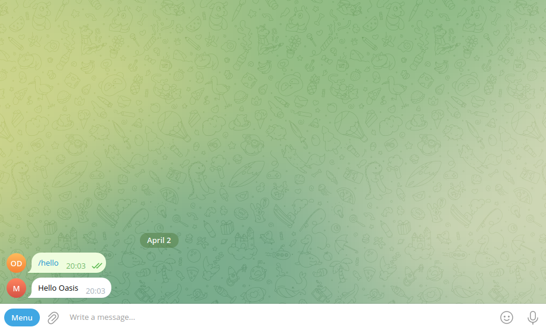
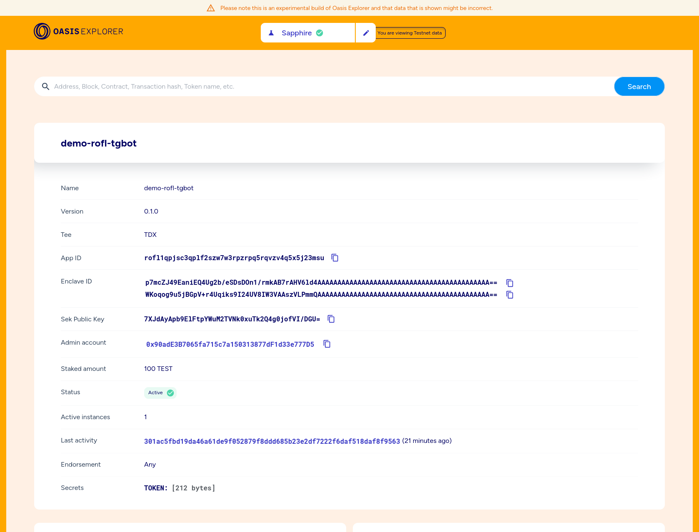

import Tabs from '@theme/Tabs';
import TabItem from '@theme/TabItem';

# Private Telegram Chat Bot

This chapter shows you how to build a simple Telegram bot that will run inside
ROFL. Along the way you will meet one of the most powerful ROFL features—how to
safely store your bot's Telegram API token inside a built-in ROFL key-store
protected by the Trusted Execution Environment and the Oasis blockchain!

## Prerequisites

This guide requires:
- a working python (>3.9)
- a working Docker (or Podman),
- [Oasis CLI] and
- at least 120 TEST tokens in your wallet.

Check out the [Quickstart Prerequisites] section for details.

[Quickstart Prerequisites]: ../quickstart#prerequisites
[Oasis CLI]: https://github.com/oasisprotocol/cli/blob/master/docs/README.md

## Init App

First we init the basic directory structure for the ROFL app using the [Oasis
CLI]:

```shell
oasis rofl init rofl-tgbot
cd rofl-tgbot
```

## Create App

Now create an app on Testnet (requires deposit of 100 TEST):

```shell
oasis rofl create --network testnet
```

After successful creation, the CLI will also output the new identifier, for
example:

```
Created ROFL application: rofl1qqn9xndja7e2pnxhttktmecvwzz0yqwxsquqyxdf
```

## Python Telegram Bot

Use a simple [python-telegram-bot] wrapper. As a good python citizen create
a new folder for your project. Then, set up a python virtual environment and
properly install the `python-telegram-bot` dependency:

```shell
python -m venv my_env
source my_env/bin/activate
echo python-telegram-bot > requirements.txt
pip install -r requirements.txt
```

Create a file called `bot.py` and paste the following bot logic that greets us
back after greeting it with the `/hello` command:

<details>
    <summary>bot.py</summary>
```python
import os
from telegram import Update
from telegram.ext import ApplicationBuilder, CommandHandler, ContextTypes


async def hello(update: Update, context: ContextTypes.DEFAULT_TYPE) -> None:
    await update.message.reply_text(f'Hello {update.effective_user.first_name}')


app = ApplicationBuilder().token(os.getenv("TOKEN")).build()

app.add_handler(CommandHandler("hello", hello))

app.run_polling()
```
</details>

Next, generate a Telegram API token for our bot. Search for `@BotFather` in
your Telegram app and start a chat with the `/newbot` command.
Then, you'll need to input the name and a username of your bot. Finally,
`@BotFather` will provide you a token that resembles something like
`0123456789:AAGax-vgGmQsRiwf4WIQI4xq8MMf4WaQI5x`.

As you may have noticed our bot above will read its Telegram API token from the
`TOKEN` *environment variable*. Since we'll use this variable throughout the
tutorial, let's export it for our session and then we can run our bot:

```shell
export TOKEN="0123456789:AAGax-vgGmQsRiwf4WIQI4xq8MMf4WaQI5x"
python bot.py
```

The bot should be up and running now, so you can search for its username in your
Telegram app and send it a `/hello` message:



[python-telegram-bot]: https://pypi.org/project/python-telegram-bot/

## Containerize the Bot

Create [`Dockerfile`] which copies over the python script to an alpine linux
with installed python:

<details>
    <summary>Dockerfile</summary>
```dockerfile
FROM python:alpine3.17

WORKDIR /bot
COPY ./bot.py ./requirements.txt /bot
RUN pip install -r requirements.txt

CMD ["python", "bot.py"]
```
</details>

Then add [`compose.yaml`] which simply spins up the container image from above:

<details>
    <summary>compose.yaml</summary>
```yaml
services:
  python-telegram-bot:
    build: .
    image: docker.io/YOUR_USERNAME/rofl-tgbot
    platform: linux/amd64
    environment:
    - TOKEN=${TOKEN}
```
</details>

[`Dockerfile`]: https://github.com/oasisprotocol/demo-rofl-tgbot/blob/main/Dockerfile
[`compose.yaml`]: https://github.com/oasisprotocol/demo-rofl-tgbot/blob/main/compose.yaml

## Build ROFL Bundle

To build a ROFL bundle invoke the following:

<Tabs>
    <TabItem value="Native Linux">
        ```shell
        oasis rofl build
        ```
    </TabItem>
    <TabItem value="Docker (Windows, Mac, Linux)">
        ```shell
        docker run --platform linux/amd64 --volume .:/src -it ghcr.io/oasisprotocol/rofl-dev:main oasis rofl build
        ```
    </TabItem>
</Tabs>

## Secrets

Do you recall the `TOKEN` environment variable we exported above? Now, we will
encrypt it and safely store it on-chain, so that it will be fed to our bot
container once it's started on one of the TEE provider's nodes:

```shell
echo -n "$TOKEN" | oasis rofl secret set TOKEN -
```

To submit this secret and the signatures (*enclave IDs*) of our .orc bundle
components on-chain run:

```shell
oasis rofl update
```

## Deploy

Finally, we deploy our ROFL app to a Testnet node instance offered by one of the
ROFL providers:

```shell
oasis rofl deploy
```

Congratulations, you have just deployed your first ROFL app! 🎉

Go ahead and test it by sending the `/hello` message in the Telegram app. You
can also check out your ROFL app on the [Oasis Explorer]:



:::example ROFL Telegram Bot

You can fetch a finished project of this tutorial from GitHub
[here][demo-rofl-tgbot].

:::

[oasis-cli-dl]: https://github.com/oasisprotocol/cli/releases
[demo-rofl-tgbot]: https://github.com/oasisprotocol/demo-rofl-tgbot
[Oasis Explorer]: https://explorer.oasis.io/testnet/sapphire/rofl/app/rofl1qpjsc3qplf2szw7w3rpzrpq5rqvzv4q5x5j23msu
