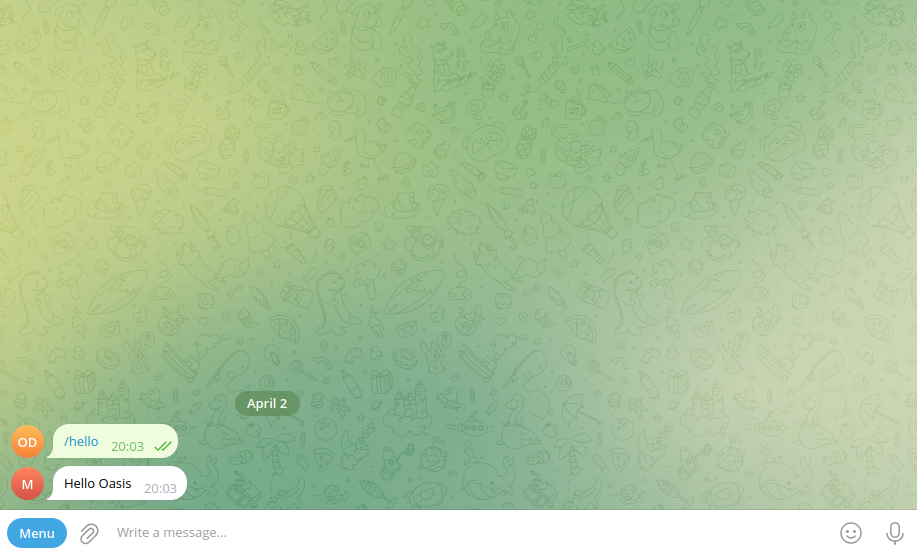
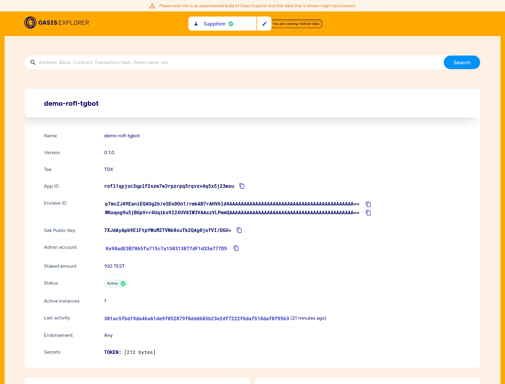

import Tabs from '@theme/Tabs';
import TabItem from '@theme/TabItem';

# Quickstart

In this tutorial we will build a simple Telegram bot that will run inside ROFL.
Along the way we will meet one of the most powerful ROFL features—how to safely
store your bot's Telegram API token inside a built-in ROFL key-store protected
by the Trusted Execution Environment and the Oasis blockchain!

## Python Telegram Bot

We will use a very simple [python-telegram-bot] wrapper. As a good python
citizen create a new folder for your project. Then, set up a python virtual
environment and properly install the `python-telegram-bot` dependency:

```shell
python -m venv my_env
source my_env/bin/activate
echo python-telegram-bot > requirements.txt
pip install -r requirements.txt
```

Create a file called `bot.py` and paste the following bot logic that greets us
back after greeting it with the `/hello` command:

```python title="bot.py"
import os
from telegram import Update
from telegram.ext import ApplicationBuilder, CommandHandler, ContextTypes


async def hello(update: Update, context: ContextTypes.DEFAULT_TYPE) -> None:
    await update.message.reply_text(f'Hello {update.effective_user.first_name}')


app = ApplicationBuilder().token(os.getenv("TOKEN")).build()

app.add_handler(CommandHandler("hello", hello))

app.run_polling()
```

Next, we'll need to generate a Telegram API token for our bot. Search for
`@BotFather` in your Telegram app and start a chat with the `/newbot` command.
Then, you'll need to input the name and a username of your bot. Finally,
`@BotFather` will provide you a token that resembles something like
`0123456789:AAGax-vgGmQsRiwf4WIQI4xq8MMf4WaQI5x`.

As you may have noticed our bot above will read its Telegram API token from the
`TOKEN` *environment variable*. Since we'll use this variable throughout the
tutorial, let's export it for our session and then we can run our bot:

```shell
export TOKEN="0123456789:AAGax-vgGmQsRiwf4WIQI4xq8MMf4WaQI5x"
python bot.py
```

The bot should be up and running now, so you can search for its username in your
Telegram app and send it a `/hello` message:



[python-telegram-bot]: https://pypi.org/project/python-telegram-bot/

## Dockerize the Bot

Web services are best maintained if they are run in a controlled environment
also known as *a container*. This includes the exact version of the operating
system, both system and user libraries, and your carefully configured service.
The image of the container is uploaded to an *OCI file server* (e.g. docker.io,
ghcr.io) from where the server hosting your bot downloads it.

In our example we will use Docker to build a python-based image and add our
Telegram bot on top of it. Go ahead and [install Docker][docker] on your
system. Then, inside our project folder create a file called `Dockerfile` with
the following content:

```dockerfile title="Dockerfile"
FROM python:alpine3.17

WORKDIR /bot
COPY ./bot.py ./requirements.txt /bot
RUN pip install -r requirements.txt

ENTRYPOINT ["python", "bot.py"]
```

Next, create a `compose.yaml` file which orchestrates our container:

```yaml title="compose.yaml"
services:
  python-telegram-bot:
    build: .
    image: "ghcr.io/oasisprotocol/demo-rofl-tgbot"
    platform: linux/amd64
    environment:
      - TOKEN=${TOKEN}
```

Let's build the docker image now and test it locally with the `docker compose`
command:

```shell
docker compose build
docker compose up
```

If you launch your Telegram app and send a `/hello` message to our bot, you
should get the same response back as you did previously—this time running inside
a Docker container.

:::tip Adjust `image:` field to fit your needs

The `image:` field(s) in `compose.yaml` above must point to a publicly
accessible OCI file server where your image will be downloaded from for
execution. In our example, we didn't push a new image, but just used
`ghcr.io/oasisprotocol/demo-rofl-tgbot` prepared by the Oasis team and combined
with our `TOKEN` secret.

If you wish to build and deploy your own image, replace the `image:` field with
a fully qualified domain of the OCI server you use followed by your username,
for example:

- `docker.io/your_username/demo-rofl-tgbot`
- `ghcr.io/your_username/demo-rofl-tgbot`

After building and tagging the image with `docker compose build`, run
`docker compose push` to upload it.

:::

[docker]: https://www.docker.com/

## ROFLize the Bot

The final step is to prepare our Docker container for execution inside the
*Trusted Execution Environment (TEE)*. First, download the latest release of the
Oasis CLI [here][oasis-cli-dl] and install it on your computer.

If you don't have an existing account on Oasis Sapphre Testnet chain, you will
need to create or import it with the [`oasis wallet create`] or [`oasis wallet
import`] commands respectively. Then, fund the acount with ~110 TEST tokens: 100
tokens for the ROFL registration escrow and another 10 TEST or so for paying
different kinds of gas fees. To fund the account with TEST tokens, visit the
official [Oasis Testnet faucet] or reach out to us on the
[`#dev-central` channel on Discord][discord].

[`oasis wallet create`]: https://github.com/oasisprotocol/cli/blob/master/docs/wallet.md#create
[`oasis wallet import`]: https://github.com/oasisprotocol/cli/blob/master/docs/wallet.md#import


[Oasis Testnet faucet]: https://faucet.testnet.oasis.io
[discord]: https://oasis.io/discord

Next, inside our project folder, run the following command to generate the
initial `rofl.yaml` manifest file and to register a new ROFL app on Sapphire
Testnet:

```shell
oasis rofl init
oasis rofl create
```

Now, we will build the *ROFL bundle* .orc. This file packs `compose.yaml`,
specific operating system components and the hash of a trusted block on the
Sapphire chain. All these pieces are needed to safely execute our bot
inside TEE.

<Tabs>
    <TabItem value="Native Linux">
        ```shell
        oasis rofl build
        ```
    </TabItem>
    <TabItem value="Docker (Windows, Mac, Linux)">
        ```shell
        docker run --platform linux/amd64 --volume .:/src -it ghcr.io/oasisprotocol/rofl-dev:main oasis rofl build
        ```
    </TabItem>
</Tabs>

Do you recall the `TOKEN` environment variable we exported above? Now, we will
encrypt it and safely store it on-chain, so that it will be fed to our bot
container once it's started on one of the TEE provider's nodes:

```shell
echo -n "$TOKEN" | oasis rofl secret set TOKEN -
```

To submit this secret and the signatures (*enclave IDs*) of our .orc bundle
components on-chain run:

```shell
oasis rofl update
```

Finally, we deploy our ROFL app to a Testnet node instance offered by one of the
ROFL providers:

```shell
oasis rofl deploy
```

Congratulations, you have just deployed your first ROFL app! 🎉

Go ahead and test it by sending the `/hello` message in the Telegram app. You
can also check out your ROFL app on the [Oasis Explorer]:



:::info Example: demo-rofl-tgbot

You can fetch a finished project of this tutorial from GitHub
[here][demo-rofl-tgbot].

:::

The tutorial above was just a Quickstart demonstrating how simple it is to run
your app inside a Trusted Execution Environment with Oasis ROFL. Read the
following chapters to take a deep dive into unique confidential features enabled
by the Oasis platform.

[oasis-cli-dl]: https://github.com/oasisprotocol/cli/releases
[demo-rofl-tgbot]: https://github.com/oasisprotocol/demo-rofl-tgbot
[Oasis Explorer]: https://pr-1777.oasis-explorer.pages.dev/testnet/sapphire/rofl/app/rofl1qpjsc3qplf2szw7w3rpzrpq5rqvzv4q5x5j23msu
